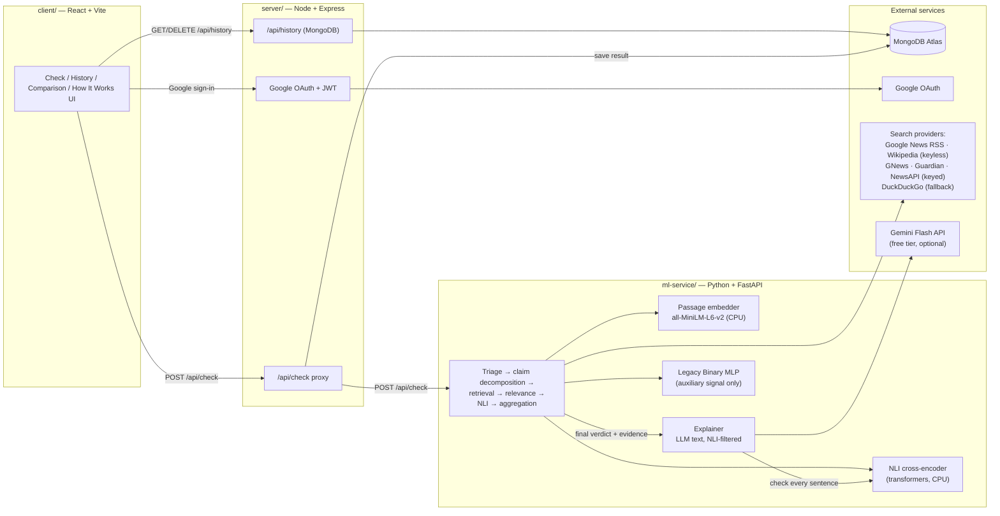
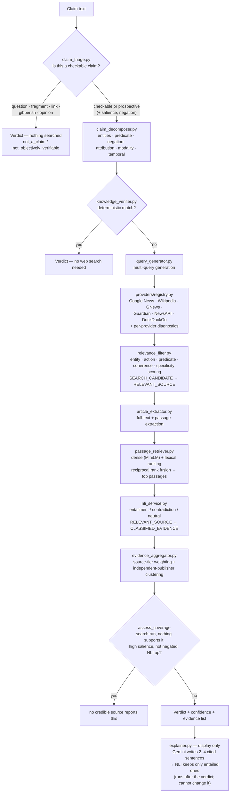

# NewsChecker

**An evidence-first fact-checking system** — paste a claim or a news headline, and NewsChecker decomposes the proposition, retrieves independent evidence from the live web, checks it against the claim with a natural-language-inference (NLI) model, and returns a conservative, evidence-backed verdict. It abstains rather than guesses when the evidence isn't there.

This is a full-stack, three-service application: a React frontend, a Node/Express API gateway, and a Python/FastAPI ML service that owns claim understanding, retrieval, and NLI verification.

**🎬 Demo video:** _link coming soon_ <!-- replace with the recording URL -->

<p align="center">
  
</p>

---

## Table of contents

- [What this actually does](#what-this-actually-does)
- [Screenshots](#screenshots)
- [Architecture](#architecture)
- [Design principles](#design-principles)
- [Hybrid retrieval & grounded explanations](#hybrid-retrieval--grounded-explanations)
- [Tech stack](#tech-stack)
- [API reference](#api-reference)
  - [`POST /api/check` response schema](#post-apicheck-response-schema)
  - [`GET /api/health` response schema](#get-apihealth-response-schema)
  - [Auth & history endpoints](#auth--history-endpoints)
- [Database schema](#database-schema)
- [Environment variables](#environment-variables)
- [Local development](#local-development)
- [Testing](#testing)
- [Running this for a demo](#running-this-for-a-demo)
  - [NLI model & memory](#nli-model--memory)
- [Model performance (legacy MLP)](#model-performance-legacy-mlp)
- [Project structure](#project-structure)
- [Known limitations](#known-limitations)
- [License](#license)

---

## What this actually does

Type a claim like *"The US Federal Reserve raised interest rates by 0.25% in its latest meeting"* and NewsChecker:

1. **Triages the claim** (`claim_triage.py`) — decides what kind of question it even poses, before any network work. A question, a fragment, keyboard mash, or a value judgment is reported as such and never searched. A claim about a *future* event is marked prospective: nothing can make it true or false today. It also judges **salience** — would a true version of this claim necessarily have been reported? — and whether the claim is negated. Both feed the absence-of-coverage rule below.
2. **Understands the claim** — extracts entities, the core predicate/action, negation, attribution ("officials said" vs "officials denied"), modality (factual vs speculative), and temporal constraints.
3. **Applies a deterministic check**, for claims with an unambiguous, well-known answer (basic arithmetic, textbook science/geometry facts, a small set of verified historical facts) — no web search needed, no ambiguity.
4. Otherwise, **generates multiple targeted search queries** (exact headline, proposition, entity-pair, contradiction/verification queries) and **retrieves candidates** from several providers. Google News RSS and Wikipedia need no API key and are on by default; GNews, The Guardian and NewsAPI join in when their keys are configured.
5. **Filters for relevance** using entity, **action**, predicate, coherence and specificity scoring. Sharing a keyword with the claim — a number, an entity name — is not relevance; neither is being about the right subjects while never mentioning the event the claim asserts.
6. **Runs NLI** (natural language inference) on the surviving candidates' passages against the claim, classifying each as entailment (supports), contradiction, or neutral. Which passages NLI reads is decided by **hybrid retrieval** — sentence embeddings fused with word overlap — so a debunk written in its own words is not skipped.
7. **Aggregates evidence** — weighting by source tier (primary/fact-check/reporting/reference/unclassified) and counting independent *publisher* domains, so five articles from one outlet don't outweigh one from another.
8. **Returns a verdict** with a categorical confidence (not a fake-precision percentage) and the actual evidence used — explicitly distinguishing sources that were *found* from sources that were *verified*, and sources that address the claim from sources that merely cover the topic.
9. **Explains the verdict** in two to four cited sentences written by an LLM (Gemini Flash) — *after* the verdict is final, and only with sentences the NLI model confirms are entailed by the source they cite. The LLM never decides or changes anything. See [Hybrid retrieval & grounded explanations](#hybrid-retrieval--grounded-explanations).

### The verdicts it can return

The point of the triage and aggregation stages is that these are genuinely different answers. Earlier versions collapsed most of them into "insufficient evidence", which made a correct abstention indistinguishable from a bug:

| `verification.status` | Shown as | What it means |
|---|---|---|
| `supported` | evidence supports the claim | Classified sources entail the claim. |
| `contradicted` | evidence contradicts the claim | Classified sources contradict it. |
| `mixed` | claims have mixed evidence | Credible sources point both ways. |
| `reported_plan` | reported as planned — not yet done | A prospective claim that sources report as announced. Confirms the *announcement*, not the event. |
| `unsupported_no_coverage` | no credible source reports this | A real negative finding — see below. |
| `not_verifiable_yet` | not yet verifiable — describes a future event | Prospective, and not reported as announced either. |
| `not_a_claim` | no verifiable claim found | A question, fragment, link, or unparseable text. Nothing was searched. |
| `not_objectively_verifiable` | subjective — not objectively verifiable | A value judgment. |
| `insufficient_evidence` | insufficient evidence | **A limitation on our side** — the search failed, or NLI was unavailable. Never a statement about the claim. |

### Absence of coverage as evidence

The hardest case is a fabricated but highly newsworthy claim — *"Elon Musk bought the Eiffel Tower"*. Nothing contradicts it explicitly, because no outlet writes articles denying things that never happened. Reporting "insufficient evidence" there is technically true and practically useless.

So `evidence_aggregator.assess_coverage` returns **"no credible source reports this"** — but only when *every* one of these holds, because the cost of getting it wrong is asserting that nobody reported something when we simply failed to look:

1. The search actually ran (`SEARCH_SUCCESS`, `SEARCH_PARTIAL`, or `NO_RELEVANT_RESULTS` — never `SEARCH_FAILED`).
2. It returned a real pool of candidates (≥ `MIN_CANDIDATES_FOR_ABSENCE`, currently 4).
3. Nothing in that pool supported *or* contradicted the claim — a contradiction is stronger evidence and wins on its own.
4. The claim is **high-salience**: it asserts a major event, at absolute scope or in headline form, so a true version could not have gone unreported. An ordinary claim going unreported proves nothing.
5. The claim is **not negated**. No outlet reporting that the US banned Google is exactly what *"the US did not ban Google"* predicts — treating silence as evidence against a negative claim inverts the inference.
6. The **NLI model was available**. "No source supports this" is a claim about what sources say, and we only know that if something read them.

Confidence then scales with how much of the press was actually canvassed, not with how many sources were classified — the finding *is* that none were.

The one thing this system is deliberately built **not** to do: treat "a search result exists" as "evidence." A candidate only becomes evidence after it survives relevance filtering *and* gets classified by NLI. See [Design principles](#design-principles).

## Screenshots

| | |
|---|---|
| **Check a claim** — evidence-first verdict with per-source Verified/Unverified labeling | **How It Works** — the full pipeline, explained |
|  |  |
| **Model Comparison** — why the legacy model stays auxiliary | |
|  | |

<!-- This project runs locally for demos rather than staying deployed — see
"Running this for a demo" below for why. If you do stand up a public
deployment later, drop a screenshot of it here. -->

## Architecture

Three independently deployable services:



The evidence pipeline itself, inside `ml-service/`:



### Worked example: a viral false claim

This is the situation the system exists for, and the one where a lexical
retriever fails hardest — because the posts repeating a false claim use its
exact wording, while the sources debunking it use their own.

Given the claim *"The United States banned Google across all its cities"* and a
realistic evidence pool of **eight low-quality posts repeating it** plus **two
credible sources refuting it**:

```
VERDICT : evidence contradicts the claim   ·   medium confidence

  contradicts   fact-check     Fact check: the US has not banned Google
  contradicts   reporting      No US prohibition on Google, regulators confirm
  supports      unclassified   Google banned in all United States cities, users say
  supports      unclassified   Google ban rumours spread across all US cities
  supports      unclassified   US cities Google ban: everything we know
  ... 3 more unclassified

supporting 6 · contradicting 2 · independent publishers backing the verdict: 2
```

**Six sources "support" the claim and the verdict is still `contradicted`.**
Source tiering means a fact-check and a wire report outweigh six anonymous
blogs, and the reported publisher count is the *verdict's own* side — not the
larger one.

Getting there requires several things to hold at once, each of which was
broken at some point and is now pinned by
[`tests/test_misinformation_scenario.py`](ml-service/tests/test_misinformation_scenario.py):
the dispatched queries have to contain the claim's verb; the credible sources
have to survive selection despite ranking below the rumours on lexical
relevance; the fact-check's *quotation* of the claim must not count as
supporting it; the debunking headline must not be deduplicated against the
rumour it contradicts; and neutral coverage must not dilute the direction.

## Design principles

These are the non-negotiable rules the codebase is built around — they were the direct fixes for real bugs found during development, not aspirational goals:

- **A search result is not evidence.** A candidate only counts as evidence after it passes relevance filtering *and* gets NLI-classified. The API separates `retrieval.candidate_count` (raw search hits) from `nli.classified_count` (actually checked) from `evidence.supporting_count + contradicting_count + neutral_count` (classified evidence by stance) — and the frontend never collapses these into one number.
- **NLI unavailable ≠ neutral.** If the NLI model can't be reached or fails to load, every score comes back `available: false` and the caller must treat it as abstention — never as a "neutral" classification, which would be a false signal.
- **Never rewrite the claim before checking it.** Splitting user input on sentence boundaries had no abbreviation handling and discarded short fragments, so *"The U.S. government banned Google across all cities"* became *"government banned Google across all cities"* — the subject deleted before anything was searched — and *"Apple, Google; and Microsoft were all fined"* became *"and Microsoft were all fined"*. Abbreviation protection is shared with the article splitter, and a split that orphans a fragment is abandoned in favour of the whole statement.
- **The deterministic layer only answers plain statements.** `knowledge_verifier` returns `very high` confidence and skips retrieval and NLI entirely, so a false positive there is the most confidently wrong output the system can emit. Its pattern tables match substrings, which meant *"It is false that a triangle has four sides"* (a true statement) was answered **false**, and *"Nobody claims WWII ended in 1945"* (a false statement) was answered **true**. Negated, quoted, or commented statements are now declined and handed to the evidence pipeline.
- **Out of scope is not the same as unintelligible.** Every stage here is English-only: the NLI model, the event vocabulary, the abbreviation and demonym tables, and the providers, which are queried with `lang=en`. A Hindi or Spanish claim used to come back as "no verifiable claim found", which tells the user their claim was nonsense rather than that this tool cannot read it. It is now reported as `unsupported language`. The heuristic is deliberately permissive — it errs toward attempting a borderline claim, and is tested to have **no false positives on English**, including "Marine Le Pen won the election" and "Rio de Janeiro hosted the summit".
- **"Nothing to check" ≠ "couldn't check it".** `claim_triage.py` runs before any network call. A question, a bare link, an unparseable string, or a value judgment gets `not_a_claim` / `not_objectively_verifiable` and is never searched — reporting a verification failure for text that contains no proposition tells the user their claim was checked and found wanting, which is false.
- **A claim about the future cannot be true or false yet.** Prospective claims are never returned as `supported`. Coverage of them yields `reported_plan` — the plan was reported, which is not the same as the event happening.
- **Absence of coverage is evidence only under narrow conditions.** See [Absence of coverage as evidence](#absence-of-coverage-as-evidence). In particular it never applies to a negated claim, never when the search failed, and never when NLI was unavailable.
- **Being about the right subjects isn't relevance.** `relevance_filter.py` scores whether a document discusses the *action* the claim asserts, using a synonym vocabulary so different wording still matches ("resigned" / "steps down"). For the claim *"the US is going to ban Google"*, an article headlined "Google expands advertising tools in the United States" scored 0.68 and survived strict filtering purely because both entities appeared in it.
- **An article that addresses nothing is not evidence for anything.** Sources NLI classifies as neutral are shown under *Related coverage*, explicitly not counted. They previously sat under a heading counting them as evidence, with each card asserting the source "supports" or "contradicts" the claim based on whichever score was larger — 0.04 against 0.03.
- **Search failure ≠ no evidence ≠ false.** `retrieval.status` distinguishes `SEARCH_FAILED` (all providers errored), `NO_RESULTS` (providers ran, found nothing), `NO_RELEVANT_RESULTS` (results found, none relevant), and `SEARCH_SUCCESS`/`SEARCH_PARTIAL`. These are never conflated.
- **The legacy MLP never determines the verdict.** `binary_truth_mlp.py` is a from-scratch neural net trained on the LIAR political-statements dataset. It's shown in the API response (`ml.score`) for transparency, flagged `auxiliary_only: true`, but the verdict computation (`evidence_verdict_score`, `merge_claim_summaries`) never reads it.
- **NLI label order is not standardized across models — never guess it.** Different NLI models emit their entailment/contradiction/neutral labels in different, undocumented orders. `nli_service.py` only trusts a model's real named labels (order-independent) or an explicit, manually-verified per-model lookup table — an unrecognized model emitting raw `LABEL_0`/`LABEL_1`/`LABEL_2` output makes the service report `failed` and abstain, rather than risk silently inverting every verdict.
- **Credible sources must actually get read.** Only `max_results` candidates are NLI-classified, and they were chosen by lexical relevance alone — which is backwards for a viral false claim, because the posts repeating it use its precise wording while the debunkings do not. Measured on a realistic pool, eight rumour blogs scored 0.78–0.94 and a PolitiFact fact-check scored 0.735, so the fact-check ranked **ninth** and never reached NLI: the system would have classified eight copies of the rumour and reported the claim supported. `RESERVED_TIER_SLOTS` holds places for candidates from a classified source. Reserving seats rather than adding a score bonus keeps relevance ranking untouched — there is no constant weighing "authority" against "aboutness", just a rule that if credible sources were found, some of them get read.
- **A debunking article is not evidence for the thing it debunks.** A fact-check quotes the claim it refutes — *"Posts claim the United States banned Google in all its cities"* — and an NLI model scores that as strongly entailing, because the claim is literally in the sentence. The strongest entailment and the strongest contradiction are found **independently** across passages, and passages that merely *report* a claim (`_CLAIM_REPORTING_FRAME`) are excluded from the entailment maximum. Ordinary attribution ("officials said", "according to") is deliberately untouched — that is journalism reporting a fact. Reading both scores off whichever single passage scored highest recorded PolitiFact debunkings as *supporting* the claim, at 0.95 source weight.
- **A document arguing both ways is evidence for neither.** When both directions clear the score threshold, one must be `STANCE_DOMINANCE` (1.6×) stronger to be called the document's position; otherwise its stance is `unclear`. Without that, 0.88 against 0.72 read as a confident "supports".
- **The verdict must be monotonic in the evidence.** Direction scores are weighted means over the sources that *take* that direction, not over everything classified. Averaging in neutrals made the system non-monotonic: one Reuters article entailing a claim at 0.93 gave `supported`, and adding three on-topic articles that said nothing either way dragged the mean to 0.26 and turned the same evidence into `insufficient_evidence`. More evidence, none of it disagreeing, made it less certain.
- **"Mixed" means genuinely contested, not merely two-sided.** A direction wins outright when its weighted mass is at least `DOMINANCE_RATIO` (2×) the other side's. On raw counts, one 0.40 contradiction from an unclassified blog was filed as equal to five strong reports from reputable outlets.
- **Repeated coverage from one outlet isn't independent confirmation.** `evidence_aggregator` counts distinct **publisher** domains per direction (`independent_supporting` / `independent_contradicting`), and **confidence is scaled by those, not by article count** — four copies of one wire story under one masthead are one confirmation, and used to earn "high" confidence. Aggregator links are resolved to the real publisher first (`claim_verifier.resolve_publisher_host`) — counting by URL host would have filed ten different newsrooms reached through Google News as a single origin, and tiered every one of them as "unclassified".
- **Show what was actually searched.** The response has always carried per-provider diagnostics and nothing displayed them, so a thin result was indistinguishable from a misconfigured one — and a provider that never ran is the most common reason results look wrong. The result panel now has a collapsible *How this was checked*, listing each provider, its worst outcome across queries, and how many results it contributed.
- **An LLM explains; it never decides.** The explanation is generated after every verdict field is final, its output is written only to `explanation`, and nothing reads it back — pinned by a test in which the LLM argues the opposite verdict and every verdict field stays byte-identical. Each sentence it writes must cite a source, and survives only if the NLI model finds that source entails it; if NLI is down, there is no explanation at all rather than an unchecked one.
- **A document that is not about the claim cannot take a side on it.** NLI scores two sentences, not whether they concern the same event, and SNLI-trained NLI models file unrelated pairs as contradictions. When dense ranking is available, a document whose title, snippet and decisive passage all fall below `SEMANTIC_MIN_SIMILARITY` to the claim has its stance withdrawn to *unclear*, with a note on its card. Like the numeric and staleness checks, this only withdraws a position — it never converts one into the other. Found live: a Guardian walking guide, matched on "Route" and "shuts", was deciding the verdict on a car crash.
- **Confidence is categorical, not fake-precision.** The UI shows `low` / `medium` / `high` / `very high`, not a `73.42%` number implying a calibration that doesn't exist. Where a percentage bar *is* shown (evidence-balance visualization), it reads "—" / "Not available" instead of a misleading number when there's no classified evidence to measure.

## Hybrid retrieval & grounded explanations

Two retrieval-augmented additions, both built so that turning them off — or
losing the model or API they depend on — leaves the system exactly as it was.

### 1. Hybrid passage retrieval

**What.** NLI only reads up to eight passages per article, chosen by
`article_extractor.extract_passages`. That choice is now made by two rankers
merged with **reciprocal rank fusion**:

- **lexical** — content-word overlap with the claim (the original ranking);
- **dense** — cosine similarity between `all-MiniLM-L6-v2` sentence
  embeddings of the claim and each sentence (`passage_retriever.py`), keeping
  only sentences above `SEMANTIC_MIN_SIMILARITY`.

Each sentence scores `Σ 1/(60 + rank)` over the lists it appears in; ties keep
article order. Sentences neither ranker nominates follow in the old order.

**Why.** Overlap cannot see a paraphrase, and debunks are paraphrases.
*"Washington has not prohibited the search giant anywhere in the country"*
shares no word with *"The United States banned Google across all its
cities"* — so it scored zero and lost its slot to any sentence mentioning
Google, and the article was filed as neutral. Fusion rather than replacement
because exact matches on names and numbers are the strongest relevance signal
there is, and embeddings blur them ("0.25%" and "0.75%" embed almost
identically). RRF needs no weight between the two: cosine similarities and
word counts are never put on one scale.

**Why no vector database.** Each check embeds a few hundred freshly fetched
sentences that will never be queried again; an index would cost more than it
saves. Embeddings live in memory for one request.

**Cost.** Measured on a real claim with the model warm: **~2.0 s of dense
ranking across 8 articles (107 sentences), ≈5% of a 42 s check** — the rest is
network. On that claim, hybrid ranking changed which passages NLI read for
**5 of 8** articles.

### 2. NLI-checked explanations

**What.** After the verdict is final, Gemini Flash writes 2–4 sentences
explaining why the classified evidence leads to it, citing each source as
`[n]`. Then `explainer.py` checks every sentence:

1. no citation, or a citation to a source it was not given → **dropped**;
2. `nli.score_many(sentence, [cited source text])` — the source is the
   premise, the sentence the hypothesis;
3. kept only if `decide_stance` — the same rule that classifies evidence —
   would call that "supports".

Only kept sentences are shown, each `[n]` linking to its evidence card. If NLI
is unavailable there is no explanation at all.

**Why the filter.** "Use only the evidence" in a prompt lowers the rate of
invented facts; it does not make it zero. The filter turns *the LLM was asked
to be faithful* into *every displayed sentence is entailed by the source it
cites, according to a model with different failure modes*.

**Why it cannot change the verdict.** It runs last, writes only
`explanation`, and nothing reads that back. `tests/test_explainer.py` runs the
full API with an LLM instructed to argue the opposite verdict and asserts that
every verdict field is identical with explanations on and off.

**Which evidence it sees.** Only classified sources on the verdict's side
(both sides for `mixed`). A rumour post quoted on a `contradicted` verdict would
pass the filter — it is faithful to its source — and still read as an argument
against the verdict printed above it.

### Results

Measured with `news_benchmark.py` on **one fixed set of 17 cases** (10 real
headlines from 2026-10-07 plus 7 corrupted versions), re-scored with
`--from-file` so every row reads the same claims. Live search differs between
runs, so each setting was run more than once where quota allowed; raw runs are
in [`docs/benchmarks/`](docs/benchmarks/). Explanations were off (they cannot
change a verdict). NLI model: `nli-deberta-v3-small` unless stated.

| Setting | Runs | Wrong answers | Confirmation recall | Rejected corrupted | Abstention | Mean latency |
|---|---|---|---|---|---|---|
| Lexical only (baseline) | 3 | 4, 3, 3 of 17 — **19.6%** | 3, 4, 4 of 10 | 7, 7, 6 of 7 | 17.6–23.5% | 19.5 s |
| Hybrid, floor 0.25 | 1 | 3 of 17 — 17.6% | 4 of 10 | 7 of 7 | 17.6% | 19.1 s |
| **Hybrid, floor 0.30** | 2 | 3, 3 of 17 — **17.6%** | 4, 4 of 10 | 7, 7 of 7 | 17.6% | 21.7 s |
| Hybrid, floor 0.40 | 1 | 4 of 17 — 23.5% | 4 of 10 | 7 of 7 | 11.8% | 19.4 s |
| Hybrid 0.30 + aboutness gate | 2 | 3, 3 of 17 — 17.6% | 4, 4 of 10 | 7, 7 of 7 | 17.6% | 20.3 s |
| Lexical, `MoritzLaurer` NLI | 1 | 3 of 17 — 17.6% | 4 of 10 | 6 of 7 | 23.5% | 19.5 s |
| Hybrid + gate, `MoritzLaurer` NLI | 1 | 3 of 17 — 17.6% | 4 of 10 | 6 of 7 | 23.5% | 17.9 s |

**Reading it honestly: no setting is measurably better on this benchmark.**
The lexical baseline alone moves between 3 and 4 wrong answers across runs of
identical claims, and every difference above is inside that spread. Per claim,
hybrid and lexical gave the same verdict on 16 of 17 cases in a paired run;
the one difference was a case where the lexical run's search failed.
`SEMANTIC_MIN_SIMILARITY` stays at **0.30**: tied best on wrong answers with
0.25, with two runs behind it, and between the neighbours.

**What the benchmark did find** is where the wrong answers come from, and it
was not passage selection. Inspecting each one led to two real defects, both
fixed: off-topic documents were contradicting claims at full weight (→ the
aboutness gate), and the NLI checkpoint in use scores unrelated text as
contradiction (→ the recommended model, accuracy **0.61 → 0.91** on the
labelled stance corpus). That corpus improvement did not move the live
benchmark: per claim the new model fixed two wrong answers and introduced two.
Seventeen claims cannot resolve a difference of that size.

One run was discarded and is kept as
`INVALID_hybrid030_run2_search_outage.json`: providers were rate-limited, 15
of 17 searches returned nothing, and it scored a misleading "0% wrong". The
benchmark now records retrieval status per case and flags such runs.

**Cost of hybrid retrieval**, measured on a real claim with the model warm:
~2.0 s of embedding across 8 articles (107 sentences) — about 5% of a 42 s
check. It changed which passages NLI read for 5 of 8 articles.

### Limitations of this layer

- **The benchmark is small and live.** Headlines change daily and search
  results change between runs, so differences smaller than the run-to-run
  spread above are noise, not findings.
- **NLI entailment is not truth.** The filter guarantees a sentence follows
  from its cited passage, not that the passage is right; that is what the
  source tiering and the verdict rules are for.
- **The filter is strict.** A correct sentence that combines two sources
  awkwardly, or adds a harmless connective, can be dropped. That is the
  intended trade: a missing sentence is a shortfall, an unsupported one is a
  failure.
- **Free-tier Gemini is unreliable under load** (503 "high demand"); hence
  `EXPLAIN_FALLBACK_MODELS`. When every model fails, the check still
  completes — without an explanation.
- **English only**, like the rest of the pipeline; MiniLM is an English model.

## Tech stack

| Layer | Technology |
|---|---|
| **Frontend** | React 19, Vite, vanilla CSS (no UI framework), Lucide icons, Google Identity Services |
| **API gateway** | Node.js, Express 5, Mongoose, JSON Web Tokens, `google-auth-library` |
| **ML service** | Python 3.12, FastAPI, Uvicorn, NumPy, Pandas |
| **NLI** | HuggingFace `transformers` + PyTorch (CPU-only wheel, float32), DeBERTa-v3 NLI cross-encoder — `MoritzLaurer/DeBERTa-v3-base-mnli-fever-anli` recommended |
| **Passage retrieval** | `sentence-transformers` (`all-MiniLM-L6-v2`) fused with lexical ranking by reciprocal rank fusion — in memory, no vector DB |
| **Explanations** | Gemini Flash via `google-genai` (free tier), every sentence filtered by the NLI model — never an input to the verdict |
| **Legacy ML** | From-scratch NumPy MLP + TF-IDF vectorizer (no sklearn/PyTorch) — auxiliary signal only |
| **Search providers** | Google News RSS + Wikipedia (keyless, on by default), GNews / The Guardian / NewsAPI (optional, key-gated), DuckDuckGo HTML (fallback) |
| **Database** | MongoDB (Atlas or self-hosted) via Mongoose |
| **Deployment** | Run locally for demos (see [Running this for a demo](#running-this-for-a-demo)); Render + Vercel configs included for reference |

## API reference

### `POST /api/check`

Request:

```json
{ "statement": "The US Federal Reserve raised interest rates by 0.25% in its latest meeting." }
```

`statement` must be 5–2000 characters.

#### `POST /api/check` response schema

This is the actual `CheckResponse` shape from `ml-service/main.py`, proxied unchanged by `server/routes/check.js` (with `_id` attached if the check was saved to history):

```jsonc
{
  "statement": "The US Federal Reserve raised interest rates by 0.25% in its latest meeting.",
  "claim_type": "news",              // "general factual" | "scientific" | "mathematical" | "historical" | "news" | "subjective" | ...
  "verdict": "true",                 // human-readable verdict string
  "confidence": "high",              // "low" | "medium" | "high" | "very high" — categorical, not a percentage

  // The core verification outcome — read this first.
  "verification": {
    "status": "supported",           // "supported" | "contradicted" | "mixed" | "insufficient_evidence" | "not_objectively_verifiable"
    "reasoning": "Relevant external evidence was found and classified."
  },

  // The legacy MLP signal. Advisory only — never drives the verdict.
  "ml": {
    "available": true,
    "auxiliary_only": true,
    "score": 0.61,                   // 0–1 probability from the LIAR-trained MLP
    "verdict": "probably correct",
    "threshold": 0.49
  },

  // What happened during the search phase.
  "retrieval": {
    "status": "SEARCH_SUCCESS",      // "SEARCH_SUCCESS" | "SEARCH_PARTIAL" | "SEARCH_FAILED" | "NO_RESULTS" | "NO_RELEVANT_RESULTS"
    "candidate_count": 14,           // raw search results across all providers/queries, deduplicated
    "relevant_count": 6,             // survived relevance filtering (still NOT yet "evidence")
    "diagnostics": [                 // per-provider, per-query outcome — never silently swallowed
      { "provider": "gnews", "query": "...", "enabled": true, "status": "success", "raw_result_count": 4, "normalized_result_count": 3, "error": null }
    ],
    "passage_ranking": {             // how passages were chosen for NLI ({} when nothing was searched)
      "enabled": true, "model": "sentence-transformers/all-MiniLM-L6-v2",
      "status": "ready",             // "disabled" | "loading" | "ready" | "failed" — failed ⇒ lexical ranking only
      "error": null,
      "documents": 8,                // classified documents
      "hybrid_documents": 8          // of those, ranked with dense + lexical fusion
    }
  },

  // NLI model state and how much evidence it actually classified.
  "nli": {
    "available": true,
    "status": "ready",               // "disabled" | "loading" | "ready" | "failed"
    "classified_count": 3            // sources that were actually run through NLI
  },

  // Aggregated evidence AFTER NLI classification — this is the real "evidence used" count.
  "evidence": {
    "supporting_count": 3,           // classified sources that entail the claim
    "contradicting_count": 0,
    "neutral_count": 0,              // checked, addressed neither side — shown as "Related coverage"
    "independent_groups": 3,         // distinct publishers across ALL classified evidence (search breadth)
    "independent_supporting": 3,     // distinct publishers backing each direction. THESE are what a
    "independent_contradicting": 0   // verdict rests on, and what scales confidence — not the counts above
  },

  // ── Legacy/flattened fields, kept for backward compatibility ──
  "ml_score": 0.61,
  "ml_verdict": "probably correct",
  "ml_threshold": 0.49,
  "evidence_score": 0.85,
  "evidence_stance": { "support": 0.85, "contradiction": 0.02, "net": 0.83, "verdict": "evidence supports the claim", "status": "supported", "..." : "..." },
  "combined_score": 89,              // 5–95 visual evidence-balance score — NOT a probability of truth
  "combined_verdict": "evidence supports the claim",
  "assessment_status": "supported",
  "claim_assessments": [
    { "claim": "...", "status": "supported", "verdict": "evidence supports the claim", "support": 0.85, "contradiction": 0.02, "evidence_count": 3 }
  ],
  "top_evidence": [
    {
      "title": "Fed raises rates by quarter point, signals data-dependent path ahead",
      "url": "https://reuters.com/markets/fed-rate-decision",
      "similarity": 0.0,               // not used as a relevance/truth score, kept for schema compatibility
      "stance": "supports",            // "supports" | "contradicts" | "unclear"
      "source": "Reuters",
      "best_sentence": "The Federal Reserve raised its benchmark interest rate by a quarter percentage point on Wednesday.",
      "support_score": 0.91,
      "contradiction_score": 0.02,
      "source_tier": "reporting",      // "primary" | "fact-check" | "reporting" | "reference" | "unclassified"
      "nli_available": true,           // false ⇒ this is an unverified CANDIDATE, not evidence
      "publisher": "reuters.com"       // who actually published it; differs from the URL host for aggregator links
    }
  ],
  "processing_time_seconds": 4.1,
  "reasoning": "Searched 12 sources across the configured news, reference and web providers; 3 discussed this claim and 3 were compared against it by the NLI model. 3 classified sources from 3 independent publishers support this claim.",
  "external_evidence_available": true,
  "external_evidence_checked": true,  // false ⇒ nothing was searched (deterministic check, or not a checkable claim)

  // LLM explanation of the verdict above. Display only — never an input to any field above.
  "explanation": {
    "available": true,               // false ⇒ show nothing (skipped, LLM failed, NLI down, or nothing survived)
    "reason": "",                    // why it is unavailable, when it is
    "text": "The Federal Reserve raised its benchmark rate by a quarter point [1].",  // kept sentences only
    "sentences": [                   // every sentence the LLM wrote, kept or not
      { "text": "...", "citations": [1], "kept": true, "entailment": 0.93, "drop_reason": "" }
    ],
    "dropped_count": 0,              // sentences removed: uncited, citing an unknown source, or not entailed
    "model": "gemini-3.8-flash"      // the model that actually wrote it (a fallback, if the primary failed)
  }
}
```

`[n]` in `explanation.text` is the source's 1-based position in `top_evidence`.

`verification` carries the outcome and the triage facts behind it:

```jsonc
"verification": {
  "status": "unsupported_no_coverage",  // see the verdict table above
  "reasoning": "Searched 14 sources ... the absence of any coverage is itself evidence against the claim.",
  "claim_kind": "checkable",            // "checkable" | "prospective" | "opinion" | "not_a_claim"
  "salience": "high"                    // "high" ⇒ a true version would necessarily have been reported
}
```

**Reading this correctly:**

- Always check `nli_available` (or `nli.classified_count` at the top level) before treating a `top_evidence` entry as confirmation of anything. A source with `nli_available: false` was *found*, not *verified* — the frontend labels these "Unverified" for exactly this reason.
- A `top_evidence` entry with `stance: "unclear"` and `nli_available: true` was checked and found to address neither side. It is **not** evidence; the frontend files these under *Related coverage*.
- `insufficient_evidence` is a statement about this system, not about the claim. Do not render it as a negative result.

#### `GET /api/health` response schema

```json
{
  "status": "ok",
  "service": "newschecker-ml",
  "model_loaded": true,
  "input_size": 26626,
  "threshold": 0.49,
  "nli": {
    "enabled": true,
    "model": "cross-encoder/nli-deberta-v3-base",
    "status": "ready",
    "error": null
  },
  "passage_ranking": {
    "enabled": true,
    "model": "sentence-transformers/all-MiniLM-L6-v2",
    "status": "ready",
    "error": null
  },
  "explanations": {
    "enabled": true,
    "model": "gemini-3.8-flash",
    "fallback_models": ["gemini-3.5-flash-lite"],
    "status": "ready",
    "error": null
  },
  "search_providers": {
    "gnews":      { "enabled": false, "status": "no_key" },
    "guardian":   { "enabled": false, "status": "no_key" },
    "newsapi":    { "enabled": false, "status": "no_key" },
    "duckduckgo": { "enabled": true,  "status": "ready" }
  }
}
```

No secrets are ever included in this response. This should be the first thing you check when debugging a deployment.

#### Auth & history endpoints

All served by `server/` (Express), all under `/api`:

| Method | Path | Auth | Purpose |
|---|---|---|---|
| `POST` | `/api/auth/google` | — | Exchange a Google ID token for the app's own JWT |
| `GET` | `/api/auth/me` | Bearer JWT | Fetch the logged-in user's profile |
| `GET` | `/api/history?limit=&skip=` | Bearer JWT | Paginated list of the user's past checks (summary fields only) |
| `GET` | `/api/history/:id` | Bearer JWT | Full saved check, same shape as a live `/api/check` response |
| `DELETE` | `/api/history/:id` | Bearer JWT | Delete one saved check |
| `GET` | `/api/health` | — | Express proxy health (separate from the ML service's own `/api/health`) |

## Database schema

`server/models/Check.js` (Mongoose). Stores the full structured response (not just the legacy flattened fields) so that loading a check from history renders identically to a live result:

```js
{
  userId: ObjectId,              // ref User, indexed
  statement: String,
  createdAt / updatedAt,         // automatic timestamps

  // Legacy flattened fields
  mlScore: Number, mlVerdict: String,
  evidenceScore: Number,
  evidenceStance: { support, contradiction, net, verdict },
  combinedScore: Number, combinedVerdict: String,
  assessmentStatus: String,
  claimAssessments: [{ claim, status, verdict, support, contradiction, evidenceCount }],
  topEvidence: [{ title, url, similarity, stance, source, best_sentence,
                  support_score, contradiction_score, source_tier, nli_available }],
  processingTime: Number,

  // Structured schema (mirrors the live CheckResponse)
  claimType: String, verdict: String, confidence: String, reasoning: String,
  externalEvidenceAvailable: Boolean, externalEvidenceChecked: Boolean,
  verification: { status, reasoning },
  ml: { available, auxiliaryOnly, score, verdict, threshold },
  retrieval: { status, candidateCount, relevantCount, diagnostics: [Mixed] },
  nli: { available, status, classifiedCount },
  evidenceSummary: { supportingCount, contradictingCount, neutralCount, independentGroups },
}
```

`server/models/User.js` is a small Google-OAuth profile (`googleId`, `email`, `name`, `avatar`).

## Environment variables

### ML service (`ml-service/` — Render-specific vars matter only if you deploy it)

**Search providers.** Google News RSS and Wikipedia require no key and are enabled by default; set their flag to `false` to switch one off. The keyed providers are skipped (with a `disabled` diagnostic, never silently) when their key is absent. `GET /api/health` reports the live state of all six.

| Variable | Default | Purpose |
|---|---|---|
| `GOOGLE_NEWS_ENABLED` | `true` | Google News RSS. No key. Best coverage for recent headlines. |
| `WIKIPEDIA_ENABLED` | `true` | Wikipedia search. No key. Background knowledge for timeless claims. |
| `DUCKDUCKGO_ENABLED` | `true` | DuckDuckGo HTML scrape. No key, frequently rate-limited or blocked. |
| `GNEWS_API_KEY` | unset | Enables the GNews provider. |
| `GUARDIAN_API_KEY` | unset | Enables The Guardian provider. |
| `NEWSAPI_KEY` | unset | Enables the NewsAPI provider. |


| Variable | Required? | Default | Notes |
|---|---|---|---|
| `NLI_ENABLED` | No | `true` | Set `false` only to intentionally disable NLI (e.g. emergency memory mitigation). |
| `NLI_MODEL` | No | `cross-encoder/nli-deberta-v3-base` | HuggingFace model id. See [NLI model & memory](#nli-model--memory) before changing this. |
| `GNEWS_API_KEY` | No | — | Enables the GNews provider. Without it, only DuckDuckGo runs. |
| `GUARDIAN_API_KEY` | No | — | Enables The Guardian provider. |
| `NEWSAPI_KEY` | No | — | Enables the NewsAPI provider. |
| `NLI_PRELOAD` | No | `true` | Load the NLI model (and the passage embedder, when `SEMANTIC_PASSAGES` is on) at startup instead of on the first request. Leave this on: lazily loading it meant the first evidence-requiring request paid for the model download *inside the HTTP request*, unbounded by `EVIDENCE_BUDGET_SECONDS`. Startup takes longer on a cold cache, but that cost is visible in the log instead of surfacing as a mystery timeout. |
| `SEMANTIC_PASSAGES` | No | `true` | Dense + lexical hybrid passage ranking. `false` restores word-overlap ranking exactly. |
| `PASSAGE_EMBED_MODEL` | No | `sentence-transformers/all-MiniLM-L6-v2` | Sentence-embedding model for passage ranking (~90 MB, CPU). |
| `SEMANTIC_MIN_SIMILARITY` | No | `0.30` | Cosine floor below which the embedder nominates nothing. See the sweep in [Hybrid retrieval](#hybrid-retrieval--grounded-explanations). |
| `EXPLANATIONS_ENABLED` | No | `true` | NLI-checked LLM explanations. Without `GOOGLE_API_KEY` they are reported unavailable, never faked. |
| `GOOGLE_API_KEY` | No | — | Gemini API key (free at aistudio.google.com). **Secret — `.env` only.** |
| `EXPLAIN_MODEL` | No | `gemini-3.8-flash` | Model that writes explanations. |
| `EXPLAIN_FALLBACK_MODELS` | No | `gemini-3.5-flash-lite` | Comma-separated; tried in order only if the model before fails (free-tier models return 503 under load). Empty = primary only. |
| `EXPLAIN_TIMEOUT_SECONDS` | No | `10` | Per-attempt limit. Runs after `EVIDENCE_BUDGET_SECONDS`, not inside it. The Gemini API refuses deadlines under 10 s. |
| `EVIDENCE_BUDGET_SECONDS` | No | `45` | Hard ceiling on the evidence phase of one `/api/check`, shared across every extracted claim. Bounds search + article extraction so a blocked provider degrades to partial evidence instead of hanging the request. Must stay comfortably below the server's `ML_SERVICE_TIMEOUT_MS`. |
| `PORT` | No | `8000` | Set automatically by Render; the Dockerfile's `CMD` already handles `${PORT:-8000}`. |

### Server (`server/` — Vercel-specific vars matter only if you deploy it)

| Variable | Required? | Default | Notes |
|---|---|---|---|
| `MONGODB_URI` | **Yes** (for persistence) | `mongodb://localhost:27017/newschecker` | Without a reachable Mongo, the server still boots and `/api/check` still works — history/auth just won't persist. |
| `JWT_SECRET` | **Yes in production** | a hardcoded dev-only string | **The server throws at startup if `NODE_ENV=production` and this is unset** — set it before deploying. |
| `GOOGLE_CLIENT_ID` | **Yes** (for sign-in) | — | From Google Cloud Console. Must match the client's `VITE_GOOGLE_CLIENT_ID`. **This is a security control, not just configuration:** it is passed to `verifyIdToken` as `audience`, and google-auth-library skips the audience check entirely when that value is undefined — so an ID token minted for *any other* Google application would authenticate. **The server throws at startup if `NODE_ENV=production` and this is unset**, and refuses sign-in with a 503 in development. |
| `FASTAPI_URL` | **Yes** in production | `http://localhost:8000` | Must point at your ML service. **A stale value here is the single most confusing failure this project has**: every check is proxied to a dead host and comes back `502` while your local ml-service sits idle logging nothing, which looks exactly like a broken local service. The server now prints its forwarding target at boot and warns when it is remote — check that line first. |
| `CLIENT_URL` | No | `http://localhost:5173` | CORS origin. Only matters if client and server are deployed as separate origins. |
| `ML_SERVICE_TIMEOUT_MS` | No | `180000` | Ceiling on the Node→FastAPI proxy call, so a hung ML service can't hang Express forever. 180s by default to cover the NLI model's first-time download plus a DuckDuckGo-only retrieval pass — see [Running this for a demo](#running-this-for-a-demo). |
| `NODE_ENV` | Set by platform | — | Vercel sets this to `production` automatically — this is what triggers the `JWT_SECRET` requirement above. |

### Client (`client/` — build-time Vite variables, baked in at build)

| Variable | Required? | Default | Notes |
|---|---|---|---|
| `VITE_API_URL` | No | `""` (same-origin) | Only set this if the client is deployed as a **separate** project from the server. |
| `VITE_GOOGLE_CLIENT_ID` | **Yes** (for sign-in) | — | Public Google OAuth client ID — same value as the server's `GOOGLE_CLIENT_ID`. |

## Local development

Requires Node.js 18+, Python 3.9+, and MongoDB (local or Atlas — optional for basic `/api/check` testing).

```bash
# 1. ML service
cd ml-service
python -m venv .venv && source .venv/bin/activate   # optional but recommended
pip install -r requirements.txt
python main.py                          # http://localhost:8000

# 2. Node/Express server (new terminal)
cd server
npm install
npm run dev                             # http://localhost:3001

# 3. React frontend (new terminal)
cd client
npm install
npm run dev                             # http://localhost:5173
```

Each service ships a `.env.example`; copy it to `.env` and fill in what you need. On Windows, `scripts/demo_warmup.ps1` starts all three services and warms both models in one step.

The first evidence check (a non-deterministic claim) triggers the NLI model download on first use — this can take a minute depending on your connection. Deterministic claims (basic science/math facts) never touch NLI or the network at all.

## Testing

```bash
# ML service — 517 tests (pytest + httpx: pip install -r requirements-dev.txt)
# covering claim normalisation and triage, claim
# decomposition, coverage modes and article dating, relevance and action
# filtering, query generation, numeric-consistency and boilerplate guards,
# HTML extraction hazards, NLI label-mapping safety, the stance rule, evidence
# aggregation, absence-of-coverage rules, provider failure/diagnostics
# handling, keyless-provider parsing, pipeline time budgets, and end-to-end
# verdict behaviour for every claim shape (tests/test_claim_edge_cases.py),
# hybrid passage ranking (tests/test_dense_passages.py) and NLI-checked
# explanations (tests/test_explainer.py). tests/conftest.py switches both new
# features off and forces Hugging Face offline mode, so no test downloads a
# model or calls Gemini.
cd ml-service
pip install -r requirements.txt
python -m pytest tests/ -q
# (falls back to: python -m unittest discover -s tests -v)

# Provider coverage comes in three layers, and it is worth knowing which one
# answers which question:
#
#   tests/test_keyless_providers.py    parsing, against captured payload shapes
#   tests/test_provider_live_path.py   the real fetch — a genuine socket, real
#                                      HTTP, real headers and decoding, served
#                                      from 127.0.0.1
#   check_providers.py                 the live internet: is the host reachable
#                                      from HERE, is my API key valid, am I
#                                      being rate-limited
#
# Only the last one can answer the questions that actually ruin a demo, and no
# offline test ever will. Run it before showing this to anyone:

cd ml-service && python check_providers.py

# It prints one line per provider and exits non-zero if nothing works:
#
#   ok   google_news  (0.4s) 3 results
#        Reuters                India's prime minister resigns after coalition...
#   ok   wikipedia    (0.3s) 3 results
#   FAIL duckduckgo   (2.1s) HTTP 429 — rate limited. Wait, or configure a
#                            keyed provider instead.
#   skip gnews        GNEWS_API_KEY not set — optional, improves recall
#
# A blocked or rate-limited provider returns nothing, the pipeline reports
# insufficient evidence, and the natural conclusion is that the fact-checker is
# broken — when in fact no search ran. This separates those two cases in about
# ten seconds.

# Tuning the stance thresholds. STANCE_THRESHOLD and STANCE_DOMINANCE decide,
# for every document read, whether it counts as supporting the claim,
# contradicting it, or neither. They were chosen by hand; this measures them
# against a labelled corpus using the real NLI model, so they can be set from
# data. Needs transformers + torch, which is why it is a script and not a test.

cd ml-service && python stance_sweep.py            # add --show-errors for the
                                                   # pairs it currently misses
#
#  thresh  domin    acc  sup P  sup R  con P  con R  invented
#  --------------------------------------------------------------
#    0.35    1.6   ....   ....   ....   ....   ....       ...  <- current
#
# 'invented' counts documents recorded as taking a position they do not take.
# That column matters more than accuracy: a threshold set too low manufactures
# confirmations out of coverage that said nothing, and a wrong answer is worse
# than no answer. Prefer a setting in the middle of a stable region over one
# that peaks — a peak a 0.02 step falls off is a fit to the corpus, not to the
# model.

# Measuring accuracy on TODAY's news. This is the answer to "how accurate is
# it?" — there is no labelled corpus of today's news and there cannot be
# (labelling it is the task), so the benchmark builds one: today's real
# headlines are the positive class, and corrupted versions of them are the
# negative class.

cd ml-service && python news_benchmark.py            # add --limit / --save
#
#   Real headlines (12)        — can it confirm what was actually reported?
#     confirmed          ..    recall, and an UPPER bound
#     not established    ..    a shortfall, not a false statement
#     stated as false    ..    a wrong answer
#
#   Corrupted headlines (9)    — does it refuse what the coverage contradicts?
#     rejected           ..
#     not established    ..    refused, but without finding the refutation
#     confirmed as true  ..    a wrong answer
#
#   WRONG-ANSWER RATE  ../..   confident statements that were false
#
# The two halves are never averaged, because they measure different things:
#
#   - The confirmation rate is an upper bound. The headlines come from the
#     same indexes the system searches, so confirming one is closer to "can it
#     find the article it came from" than "can it establish a fact".
#   - Rejecting corrupted headlines is necessary, not sufficient. Real
#     misinformation is built to be plausible and often carries supporting
#     coverage from poor sources; a corrupted headline carries none.
#
# The wrong-answer rate is the number worth quoting: missing a true claim is a
# shortfall, asserting a false one is the failure a fact-checker must not make.
# Needs live network, like check_providers.py. The corpus construction and
# scoring are unit-tested offline (tests/test_news_benchmark.py) — a corrupted
# headline that is ungrammatical rather than false tests the parser, not the
# fact-checker, and would make the number meaningless.

# Server — 24 tests: auth middleware, history pagination, proxy validation.
# No database or network required.
cd server && npm test

# Client — render smoke test. Loads every route in a built client and fails on
# any runtime error. `npm run build` and eslint BOTH pass on a component that
# references an undefined identifier, so a missing import ships as a blank
# white page with every check green — this is what catches that.
# Playwright is not a dependency; the script skips itself with instructions
# when it is absent.
cd client && npm run build && npx vite preview --port 4173 &
npm run smoke

# Client — lint + production build
cd client
npm run lint
npm run build
```

`server/` has 24 tests (`cd server && npm test`, Node's built-in runner, no database or network required) covering the auth middleware, history pagination and the `/api/check` proxy's validation and error mapping.

## Running this for a demo

**This project is run locally, not deployed to an always-on public host.** Real NLI inference (a transformer model, PyTorch) is expensive to host reliably on free-tier infrastructure — a small instance either can't fit the model in memory or has to compromise on accuracy to fit, and it sleeps/cold-starts when idle. A live link that occasionally shows a mid-restart or a 60-second cold start makes the project look worse than not having one.

For a demo (an interview, a walkthrough), run all three services locally per [Local development](#local-development) — on a normal dev machine there's several GB of headroom, so the full-accuracy NLI model runs comfortably. This also means you're demoing from an environment you control, with no cold-start or infra surprises mid-conversation.

The deployment instructions below are kept for reference (e.g. if you want a permanent public link and are fine with the hosting cost that requires), not because the project currently runs on them.

<details>
<summary>Deployment instructions (optional — not currently in use)</summary>

### ML service → Render

The Dockerfile is self-contained (CPU-only PyTorch wheel, single Uvicorn worker, conservative thread limits). Point a Render Web Service at `ml-service/` with the Dockerfile build. See [Environment variables](#environment-variables) above for what to set. **Use at least a 2GB-RAM instance** — see [NLI model & memory](#nli-model--memory) below for why.

### Client + server → Vercel

The root `vercel.json` builds `client/` as a static site and `server/api/index.js` as a serverless function, with `/api/*` rewritten to the server — meaning client and server are typically **one Vercel project**, same origin, so `VITE_API_URL` can usually stay unset. `server/vercel.json` exists separately if you want to deploy the server as its own project instead (in which case you do need `VITE_API_URL` and `CLIENT_URL`).

</details>

### NLI model & memory

`NLI_MODEL` defaults to `cross-encoder/nli-deberta-v3-base`. Stance detection decides **every verdict this system produces**, so the larger checkpoint is spent exactly where it pays. This project runs locally, where a few hundred megabytes of weights cost nothing.

Smaller checkpoints are one environment variable away, and all four are pre-verified in `nli_service.py`'s label-order table:

| `NLI_MODEL` | Params | Notes |
|---|---|---|
| `cross-encoder/nli-deberta-v3-base` | ~184M | **Default.** Best stance accuracy. |
| `cross-encoder/nli-deberta-v3-small` | ~141M | Previous default. |
| `cross-encoder/nli-deberta-v3-xsmall` | ~71M | Faster startup. |
| `cross-encoder/nli-MiniLM2-L6-H768` | ~22M | Smallest; noticeably weaker. |
| `MoritzLaurer/DeBERTa-v3-base-mnli-fever-anli` | ~184M | **Recommended — set in `.env.example`.** Named labels, so no table entry is needed. |

**Why the MoritzLaurer checkpoint.** The `cross-encoder/nli-*` family is
trained on SNLI, whose annotation convention files an unrelated
premise/hypothesis pair as *contradiction*. Measured on 2026-10-07,
`nli-deberta-v3-small` scored *"The scenery on the Shropshire Way is at its
best in spring"* as a **1.00 contradiction** of *"Russia invaded Ukraine in
February 2022"* — and that one habit produced most of this system's wrong
answers: off-topic articles that reached NLI contradicted whatever they were
compared with, at full source-tier weight. The MoritzLaurer checkpoint is
trained on MNLI + FEVER + ANLI and scores the same pair **1.00 neutral**. On
`stance_sweep.py`'s labelled corpus at the shipped thresholds:

| Model | Accuracy | Contradiction precision | Invented positions |
|---|---|---|---|
| `cross-encoder/nli-deberta-v3-small` | 0.61 | 0.45 | 6 / 23 |
| `MoritzLaurer/DeBERTa-v3-base-mnli-fever-anli` | **0.91** | **0.78** | **2 / 23** |

It is not a cure: a topical sentence that simply does not mention the
claim's date ("Russia gained 90 sq km of Ukraine in August") still scores
0.99 contradiction against "…invaded Ukraine in February 2022".

On Windows the Hugging Face cache uses symlinks, which need Developer Mode or
admin rights. If a download reports `WinError 1314`, the weights are usually
fine but small tokenizer files are missing from the snapshot — re-download
them with `hf_hub_download(..., local_dir=...)` and copy them in.

Budget 1GB+ of RAM regardless of choice — PyTorch's own import footprint is 300–500MB before any weights load. Whichever you pick, measure it rather than assuming: `python stance_sweep.py --show-errors` scores the checkpoint against a labelled corpus and reports *invented positions* (sources recorded as taking a stance they do not take), which matters more than raw accuracy.

**If you set a model outside the table**, verify it once it loads:

1. Check `/api/health` → `nli.status` should be `"ready"`.
2. Check the service logs for a line like `NLI model loaded: <model> — id2label={...}` to confirm what label scheme it actually uses.
3. If `nli.status` comes back `"failed"` with an "unrecognized label" error, the model emits raw `LABEL_0`/`LABEL_1`/`LABEL_2` output that isn't in the verified table — the service is correctly refusing to guess its order. Add it to `_KNOWN_INDEXED_LABEL_ORDERS` in `nli_service.py` only once you've confirmed the real order from the model's config.

## Model performance (legacy MLP)

The **Binary Truth MLP** (`binary_truth_mlp.py`) is a from-scratch NumPy neural network (no PyTorch/sklearn) trained on the **LIAR dataset** (12,836 labeled political statements), collapsed from 6 classes to binary "Fake-ish"/"True-ish".


The production-equivalent, statement-only evaluation:

| Metric | Value |
|---|---|
| Accuracy | **61.88%**  (95% CI 59.12–64.48) |
| Majority-class baseline | 56.35% |
| Precision | 62.09% |
| Recall | 83.05% |
| F1 Score | 0.7106 |
| AUC | 0.6722 |
| Brier score | 0.2277 |
| Expected calibration error | 0.0458 |

Two things worth reading off that table rather than the accuracy alone.

**The gap is real.** The 95% bootstrap interval's *lower* bound (59.12%) sits
above the majority-class baseline (56.35%), so the model beats "always answer
true" by more than split luck. On 1267 rows a point estimate alone could not
establish that, which is why the interval is reported and not just the number.

**The probability means roughly what it says.** Expected calibration error is
0.046 — under the ~0.1 threshold beyond which a score should not be shown to a
user as a confidence. That matters more here than accuracy does, because this
number is displayed *and* consumed downstream as a prior: a model that is 62%
accurate while saying "0.9" when it means "0.6" would be worse than a less
accurate one that knows what it does not know.

This is now scored through
`make_prediction_features_batch()` — the same function `main.py` calls — so the
number describes the model as served. It previously did not: `evaluate_models.py`
fed the shipped model speaker metadata and real credit-history counts it was
never trained on and reported **56.9%**, while `evaluate_production_model.py`
transformed the raw statement instead of going through `build_text_input()` and
reported **62.35%**. Neither was what a request computes.

This model is **never used to determine the final verdict** — see [Design principles](#design-principles). It's kept visible in the API response and on the Model Comparison page purely for research transparency. Reproduce these numbers with:

```bash
cd ml-service
python evaluate_production_model.py    # the metrics above
python evaluate_models.py              # regenerates evaluation_results.json
```

## Project structure

```
newschecker/
├── client/                       React + Vite frontend
│   └── src/
│       ├── App.jsx                Root component, routing, API calls
│       └── components/            Header, EvidenceCard, ScoreGauge, ScoreBreakdown,
│                                   HowItWorks, ModelComparison, ExplanationPanel,
│                                   HistoryPanel, LoadingSkeleton
├── server/                       Node/Express API gateway
│   ├── api/index.js                Express app entry (also the Vercel serverless handler)
│   ├── routes/                     check.js (ML proxy), auth.js (Google OAuth), history.js
│   ├── middleware/auth.js          JWT sign/verify
│   └── models/                     Check.js, User.js (Mongoose schemas)
├── ml-service/                   Python/FastAPI ML service
│   ├── main.py                     FastAPI app, /api/health, /api/check
│   ├── claim_triage.py             What kind of claim is this? (checkable/prospective/
│   │                                opinion/not-a-claim, salience, negation) — pre-search
│   ├── claim_decomposer.py         Entities, predicates, negation, attribution, modality
│   ├── query_generator.py          Multi-query generation per claim
│   ├── providers/                  google_news.py + wikipedia.py (keyless), GNews, Guardian,
│   │                                NewsAPI, DuckDuckGo + registry/diagnostics
│   ├── relevance_filter.py         Candidate → relevant-source filtering (entity + action)
│   ├── article_extractor.py        Full-text + passage extraction
│   ├── passage_retriever.py        Dense passage ranking (MiniLM) + reciprocal rank fusion
│   ├── explainer.py                Gemini explanation of the verdict, filtered by NLI
│   ├── nli_service.py              Single authoritative NLI service (state machine + label safety)
│   ├── evidence_aggregator.py      Stance aggregation, independent-publisher clustering,
│   │                                absence-of-coverage assessment
│   ├── claim_verifier.py           Claim splitting, source tiering, publisher resolution
│   ├── evidence_pipeline.py        Orchestrates the stages above
│   ├── knowledge_verifier.py       Deterministic checks (arithmetic, well-known facts)
│   ├── binary_truth_mlp.py         Legacy auxiliary MLP (from-scratch NumPy)
│   ├── tfidf.py                    From-scratch TF-IDF vectorizer (feeds the legacy MLP only)
│   ├── classifier.py / mlp_classifier.py   Experimental baselines, offline evaluation only
│   ├── evaluate_models.py / evaluate_production_model.py   Offline evaluation scripts
│   └── tests/                      517 tests across the modules above, incl.
│                                    test_claim_edge_cases.py (end-to-end verdicts)
├── docs/screenshots/              README images
├── docs/benchmarks/               Saved news_benchmark runs (hybrid vs lexical)
├── docs/DEMO.md                   Demo claims, 2.5-minute script, recording checklist
├── scripts/                       demo_warmup.ps1, run_rag_benchmark.ps1 (Windows)
├── IMPROVEMENTS.md                 Dated engineering log of major fixes/audits
└── vercel.json                     Client + server deployment config
```

## Known limitations

Being direct about these matters more than pretending they don't exist:

- **`server/` test coverage is partial.** `npm test` in `server/` runs 24 tests covering the auth middleware, history pagination, and the check proxy's input validation — no database or network needed. The route handlers' database paths are still untested; that would need an in-memory Mongo.
- **Retrieval quality depends on live web search.** An unconfigured checkout retrieves from Google News RSS, Wikipedia and DuckDuckGo; adding `GNEWS_API_KEY` / `GUARDIAN_API_KEY` / `NEWSAPI_KEY` widens it further. The system is designed to abstain rather than force a weak match — but recall is still bounded by what's configured and reachable at request time, and `GET /api/health` is the place to check which providers are actually live.
- **Absence-of-coverage is an inference, not a proof.** `unsupported_no_coverage` says the providers we could reach returned nothing asserting the claim. Its guards (salience, candidate volume, non-negation, working NLI, working search) exist to keep it honest, and confidence scales with how much was searched — but a very fresh story, a non-English source, or a story outside the indexed providers can still produce it wrongly. It is deliberately never phrased as "false".
- **English only.** Claims in other languages are detected and reported as out of scope rather than checked. The detection is a heuristic over character scripts and function words; it can miss a short Latin-script sentence, in which case the claim falls through to the ordinary "no assertion found" path — a worse message, but not a wrong verdict.
- **Claim triage is heuristic.** `claim_triage.py` classifies by pattern, not by parsing. It handles the shapes in `tests/test_claim_edge_cases.py` — including the traps that broke it during development (factual superlatives read as opinions, irregular past tenses read as non-assertions, pasted links read as claims) — but an unusual phrasing can still land in the wrong bucket. The failure is designed to be safe in one direction: an over-admitted claim gets searched, an over-rejected one refuses to check something real, so the thresholds lean toward admitting.
- **Temporal checking is coarse.** The pipeline *does* now compare an article's publish date against the claim's timeframe (see [Coverage modes](#nli-model--memory) — `recent` restricts retrieval to the last 30 days and refuses to let an older article confirm the claim). Three limits remain: providers differ on whether they supply a date at all — Wikipedia and DuckDuckGo supply none, and an undated document is never treated as stale, because deleting real evidence over a missing field is the worse error; the staleness window (45 days) is deliberately wider than the retrieval window, so a document from just outside it still counts; and nothing compares a date against the article's *own* internal timeline, so a recent retrospective about an old event is still readable as current coverage.
- **Same kind of event ≠ same event.** "Crash shuts down Route 44" is about a crash closing a route, so it passes the aboutness check, and NLI reads it as contradicting "Crash shuts down Route 209". A differing number can be a genuine contradiction (a rate rise of 0.5% vs 0.25%) or a different referent (Route 44 vs Route 209); `numeric_consistency` only withdraws *support* on a mismatch, and telling the two cases apart for contradictions is open work.
- **Headline claims with weak queries.** For short headlines, `query_generator` can drop the most specific words ("Morning crash shuts down Route 209" was searched as `Route shuts`), which lets loosely related documents into the pool. The aboutness check limits the damage; it does not fix the queries.
- **Claim decomposition is regex-based, not a real parser.** `claim_decomposer.py` uses pattern matching for entities/predicates/negation/modality, not dependency parsing or a trained NER model. It works well for the claim shapes it's been tested against but isn't as robust as a full NLP pipeline would be.
- **The legacy MLP works, and still cannot be a fact-checker.** On the LIAR test set it scores **61.88%** (95% CI 59.12–64.48) against a **56.35%** majority-class baseline. The interval's lower bound clears the baseline, so that +5.5 points is a real effect rather than split luck, and the model is calibrated (ECE 0.046). It is a respectable result for judging a claim from its wording alone.

  It is still not a fact-checker, and the distinction is the architecture's whole premise: 62% on a dated US-political corpus says nothing about whether a specific claim made today is true, because the label is not deducible from the words. Only evidence settles that. So the verdict never reads this model's output — not because the model is weak, but because the task it solves is not the task the user asked.

  (This number was itself a bug for most of the project's life: the model was scored on speaker metadata it was never trained on, reporting 56.9% — see `IMPROVEMENTS.md` bug 34.)

## License

MIT.
