<div align="center">

# 🔎 NewsChecker v2

### Evidence-first fact-checking with hybrid retrieval, NLI verification and grounded explanations

Paste a claim or a headline. NewsChecker searches live news, reads what independent sources actually say,
and tells you whether the evidence supports it, contradicts it — or honestly says it can't tell.


**🎬 [Demo video](#) · 📖 [How it works](#-how-it-works) · 📊 [What I measured](#-what-i-measured) · 🚀 [Run it locally](#-run-it-locally)**

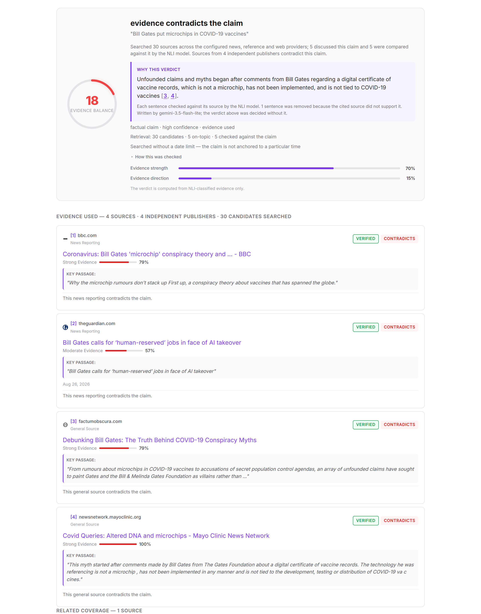

</div>

---

## Why I built this

Most "AI fact-checkers" do one of two things: they classify a claim from its wording, or they ask a
large language model whether it's true. Both fail the same way — they sound equally confident when
they're wrong, and they can't show you *why*.

I wanted the opposite: a system that **never decides from how a claim is worded**, only from what
independent sources say about it — and that treats *"I couldn't find enough evidence"* as a real,
honest answer rather than something to paper over.

So NewsChecker works like a careful researcher:

1. **Search** live news and reference sources for the claim.
2. **Read** the most relevant passages with a natural-language-inference (NLI) model trained for one
   narrow question: *does this passage say that?*
3. **Weigh** the sources — a fact-checker counts for more than an anonymous blog, and five reprints of
   one wire story count once.
4. **Explain** the verdict in plain English — with an LLM whose every sentence is checked against the
   source it cites, and which is never allowed to change the verdict.

> 💡 **v2** is a rebuild of [NewsChecker v1](https://github.com/Shoaib1M/News-Checker). It adds hybrid
> RAG retrieval, NLI-checked explanations and a measurement-driven round of fixes, and removes the old
> wording-only classifier entirely. [What changed →](#-whats-new-in-v2)

---

## ✨ Highlights

| | |
|---|---|
| 🧠 **Evidence decides, not wording** | Every verdict comes from an NLI model reading real sources. No component judges a claim from how it's phrased. |
| 🔀 **Hybrid RAG retrieval** | Passages are ranked by meaning (MiniLM embeddings) *and* wording, fused with reciprocal rank fusion — so a debunk written in its own words still gets read. |
| 🧾 **Grounded explanations** | Gemini writes a short cited explanation; every sentence must be **entailed by the source it cites** or it's dropped. It runs after the verdict and can't change it — and there's a test proving that. |
| ⚖️ **Credibility-aware** | Sources are weighted by tier (primary → fact-check → reporting → reference) and counted by **independent publisher**, not by article. |
| 🧭 **Nine honest verdicts** | Supported, contradicted and mixed — but also *"no credible source reports this"*, *"reported as planned, not yet done"*, *"subjective"*, and *"insufficient evidence"*, which is always about my system, never about your claim. |
| 🧪 **Tested and measured** | 480 offline Python tests + 24 server tests, no network or model downloads. A live benchmark on real headlines, with results reported honestly — including the null ones. |

---

## 📸 Screenshots

| Check a claim | How it works — inside the app |
|---|---|
| 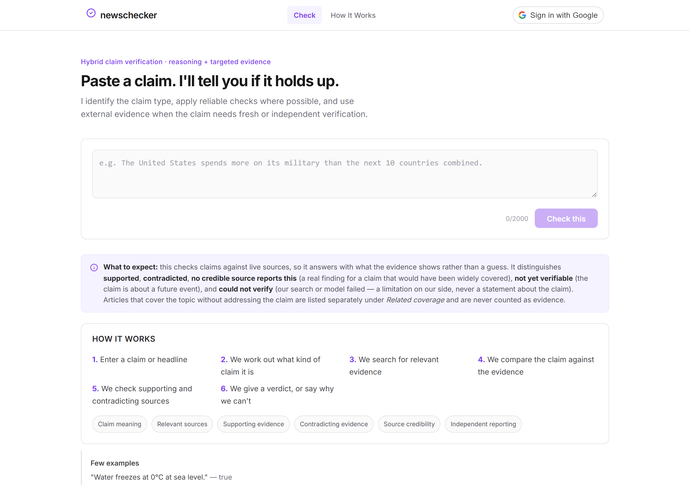 | 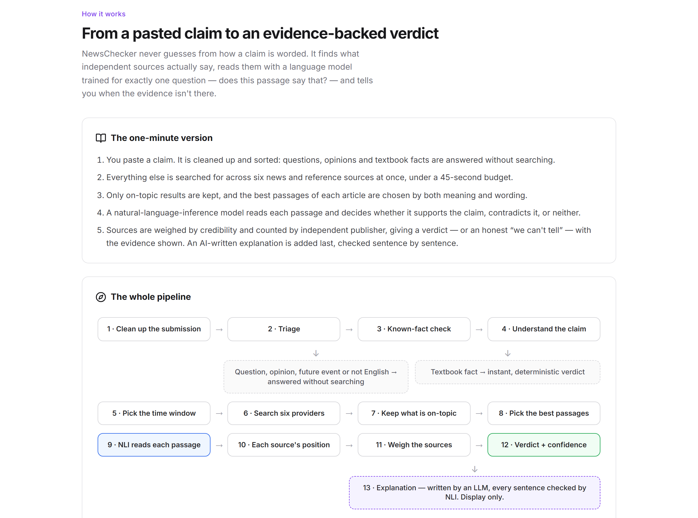 |
| **Hybrid retrieval, explained in the app** | **NLI scoring, explained in the app** |
| 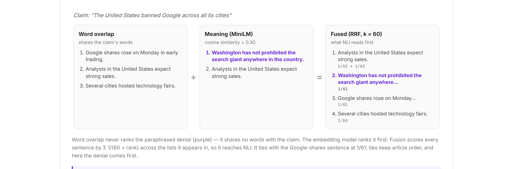 | 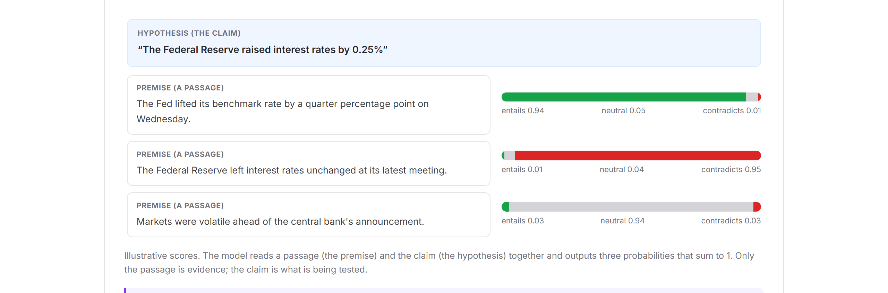 |

<p align="center">
  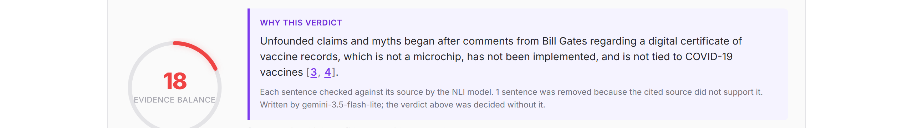<br>
  <sub>Every sentence in "Why this verdict" was checked against the source it cites. Click a citation and the evidence card highlights.</sub>
</p>

---

## 🧭 How it works

### 1. Architecture

Three services, each with one job. The ML service owns every verdict; the server handles auth,
history and proxying; the client renders evidence.

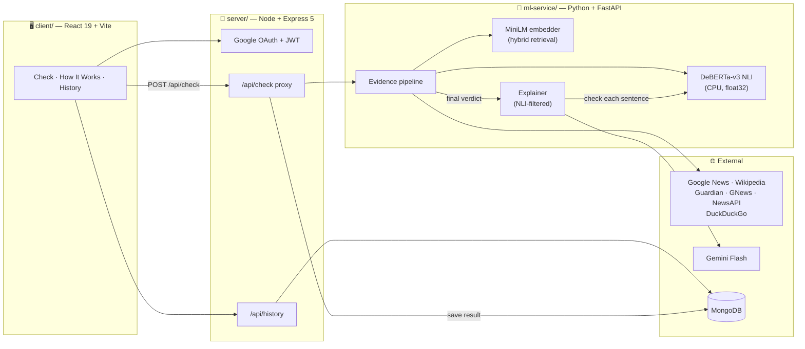

### 2. The life of one request

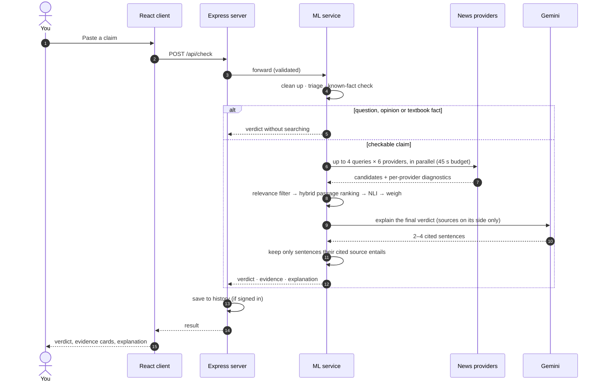

### 3. The evidence pipeline

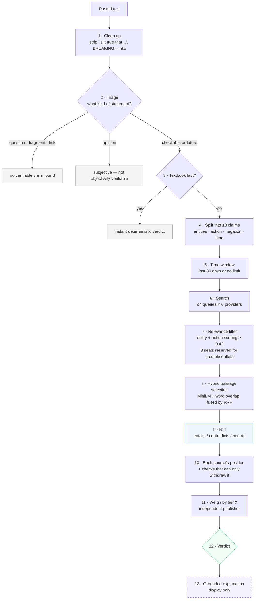

### 4. Hybrid retrieval — why I added embeddings

The NLI model only reads up to **8 passages per article**, so choosing them decides everything
downstream. Word overlap alone has a blind spot that matters most for misinformation: **debunks are
paraphrases**. *"Washington has not prohibited the search giant anywhere in the country"* shares no
words with *"The United States banned Google across all its cities"* — so it was never picked.

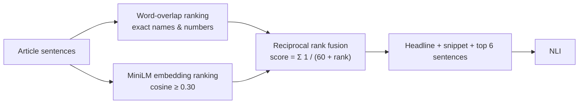

Fusion needs no tuned weight and never has to put cosine similarity and word counts on one scale.
Embeddings live in memory for one request — each check reads a few hundred fresh sentences, so a
vector database would cost more than it saves.

### 5. From passage scores to a position

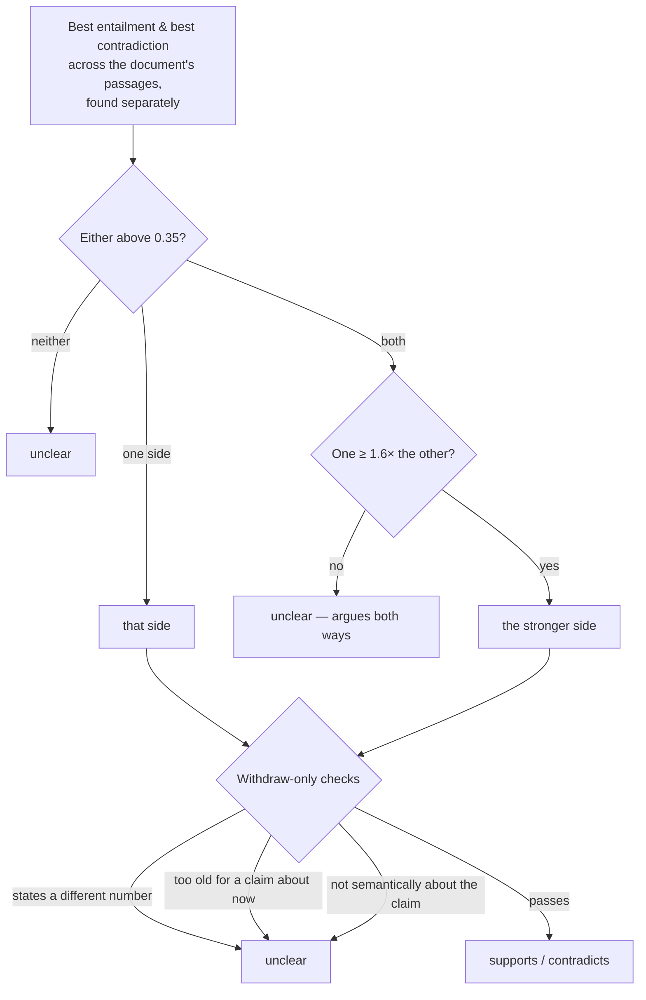

A fact-check *quotes* the claim it refutes ("Posts claim the US banned Google…"), and NLI scores that
quote as support — so passages that merely report a claim are excluded from the support score. And
every check after that can only **withdraw** a position, never flip support into contradiction.

### 6. Weighing sources into a verdict

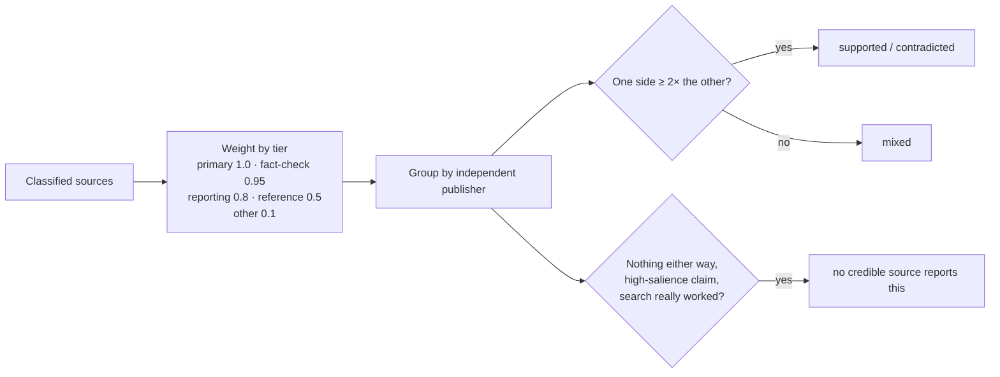

In practice: six anonymous posts "supporting" a viral false claim weigh **0.6**; a fact-check plus a
Reuters report contradicting it weigh **1.75** — so the verdict is *contradicted*, not *supported*.

### 7. Grounded explanations — an LLM that can't lie to you (much)

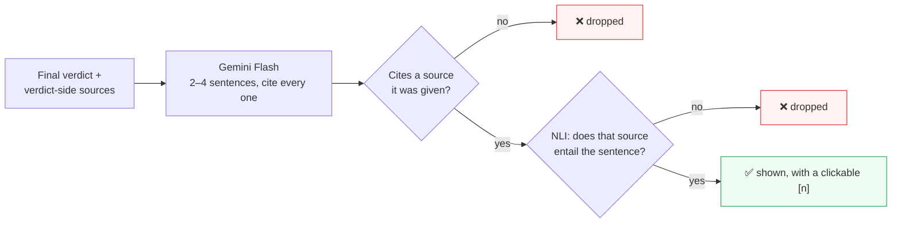

A prompt saying "only use the evidence" *reduces* invented facts — it doesn't stop them. The filter
turns "the model was asked to be faithful" into "every sentence you see was checked against its
source". The explainer runs **after** every verdict field is computed and nothing reads its output
back; a test runs the whole API with an LLM told to argue the opposite verdict and asserts every
verdict field is unchanged. If Gemini is overloaded, a fallback model is tried; if NLI is down, no
explanation is shown at all.

> 📖 The app has its own **How It Works** page that walks through all 13 stages with diagrams,
> worked examples and the exact thresholds — the screenshots above are from it.

---

## 📊 What I measured

I'd rather show honest numbers than impressive ones. Everything below was measured on 7 Oct 2026;
raw runs are in [`docs/benchmarks/`](docs/benchmarks/).

### The NLI model was the real bottleneck

Inspecting every wrong answer one by one showed the culprit wasn't retrieval — it was the NLI
checkpoint. `cross-encoder/nli-deberta-v3-small` (SNLI-trained) scores **unrelated text as a 1.00
contradiction**: *"The scenery on the Shropshire Way is at its best in spring"* "contradicted"
*"Russia invaded Ukraine in February 2022"*. On my labelled stance corpus (`stance_sweep.py`):

| NLI model | Accuracy | Contradiction precision | Invented positions | Unrelated text scored as |
|---|:-:|:-:|:-:|:-:|
| `cross-encoder/nli-deberta-v3-small` | 0.61 | 0.45 | 6 / 23 | contradiction 1.00 ❌ |
| **`MoritzLaurer/DeBERTa-v3-base-mnli-fever-anli`** | **0.91** | **0.78** | **2 / 23** | **neutral 1.00 ✅** |

### Live benchmark — today's headlines and corrupted versions of them

`news_benchmark.py` pulls real headlines, corrupts some into falsehoods, and checks both. The number
that matters is the **wrong-answer rate**: confidently stating something false.

| Setting | Runs | Wrong answers | Corrupted headlines rejected | Mean latency |
|---|:-:|:-:|:-:|:-:|
| Word-overlap passages (v1 behaviour) | 3 | 19.6% (4, 3, 3 of 17) | 20 / 21 | 19.5 s |
| Hybrid retrieval | 2 | 17.6% (3, 3 of 17) | 14 / 14 | 21.7 s |
| Hybrid + aboutness check + new NLI model | 1 | 17.6% (3 of 17) | 6 / 7 | 17.9 s |

**Honest reading:** on 17 live claims, none of these changes moved the wrong-answer rate beyond the
run-to-run noise (the baseline alone swings between 3 and 4). Hybrid retrieval changed *which passages
NLI read* for 5 of 8 articles on a real claim, at a cost of ~2 s per check (≈5%) — but this benchmark
is too small to show a verdict-level gain. I report it as a null result. What the benchmark *did* do
was lead me to the NLI problem above.

### Bugs I found by measuring, not by error messages

| Symptom | Cause | Fix |
|---|---|---|
| One benchmark run scored **0% wrong** | Every search was rate-limited; outages were counted as cautious abstentions | The benchmark now records retrieval status and flags search failures |
| Checks became **~100× slower** with the better NLI model | The checkpoint ships a `float16` config; on CPU that's 13.7 s per pair instead of 0.18 s | NLI always runs in `float32` on CPU — with a regression test |
| A walking guide "contradicted" a car-crash headline | Weak queries let off-topic articles in; SNLI-style NLI calls unrelated text a contradiction | **Aboutness check** using the embeddings: a document must be about the claim to take a side |
| Tests quietly hit the live internet | API tests loaded my real keys from `.env`; later tests used them | `conftest.py` blanks keys and forces Hugging Face offline mode |

---

## 🛠️ Tech stack

| Layer | Technology |
|---|---|
| **NLI** | Hugging Face Transformers + PyTorch (CPU, float32) · DeBERTa-v3 cross-encoder (`MoritzLaurer/DeBERTa-v3-base-mnli-fever-anli` recommended) |
| **Retrieval** | Sentence-Transformers `all-MiniLM-L6-v2` · reciprocal rank fusion · entity/action relevance scoring |
| **Explanations** | Gemini Flash via `google-genai` (free tier), fallback model, NLI faithfulness filter |
| **ML service** | Python 3.12 · FastAPI · Uvicorn · NumPy |
| **API gateway** | Node.js · Express 5 · Mongoose · JWT · Google OAuth (`google-auth-library`) |
| **Frontend** | React 19 · Vite · vanilla CSS · Lucide icons |
| **Data sources** | Google News RSS & Wikipedia (no key) · The Guardian, GNews, NewsAPI (optional keys) · DuckDuckGo (fallback) |
| **Database** | MongoDB (Atlas free tier works) |
| **Testing** | pytest (480 offline tests) · Node test runner (24) · ESLint · live benchmark scripts |

---

## 🚀 Run it locally

NewsChecker runs locally — DeBERTa + PyTorch need over 1 GB of RAM, which free hosting tiers don't offer.

**Requirements:** Python 3.12, Node.js 18+, and (optionally) MongoDB for sign-in history.

### 1. Install

```powershell
# ML service
cd ml-service
python -m venv .venv
.\.venv\Scripts\python.exe -m pip install -r requirements-dev.txt
copy .env.example .env        # then add your keys (all optional)

# API server and client
cd ..\server; npm install; copy .env.example .env
cd ..\client; npm install; copy .env.example .env
```

<details>
<summary>macOS / Linux</summary>

```bash
cd ml-service && python3 -m venv .venv && .venv/bin/pip install -r requirements-dev.txt && cp .env.example .env
cd ../server && npm install && cp .env.example .env
cd ../client && npm install && cp .env.example .env
```
</details>

### 2. Start

**One command (Windows)** — opens all three services and warms both models:

```powershell
powershell -ExecutionPolicy Bypass -File .\scripts\demo_warmup.ps1
```

**Or by hand**, in three terminals:

```powershell
cd ml-service; .\.venv\Scripts\python.exe main.py   # http://localhost:8000
cd server; npm run dev                              # http://localhost:3001
cd client; npm run dev                              # http://localhost:5173
```

Then open **http://localhost:5173**. The first start downloads the NLI and embedding models (~450 MB).

### 3. Keys (all optional)

| Variable | What it unlocks | Get it |
|---|---|---|
| `GOOGLE_API_KEY` | Grounded explanations | Free at [aistudio.google.com](https://aistudio.google.com) |
| `GUARDIAN_API_KEY` · `GNEWS_API_KEY` · `NEWSAPI_KEY` | More news coverage | Free developer keys from each provider |
| `MONGODB_URI` · `GOOGLE_CLIENT_ID` · `JWT_SECRET` (server) | Sign-in and history | MongoDB Atlas + Google Cloud Console |

Without any keys it still works: Google News and Wikipedia need none, and explanations simply don't
appear. Every switch (`SEMANTIC_PASSAGES`, `EXPLANATIONS_ENABLED`, `NLI_MODEL`, …) is documented in
[`ml-service/.env.example`](ml-service/.env.example).

### 4. Test

```powershell
cd ml-service; .\.venv\Scripts\python.exe -m pytest -q    # 480 tests, offline
cd server; npm test                                        # 24 tests
cd client; npm run lint; npm run build
```

Live checks (need network): `python check_providers.py` tells you which search providers are
reachable from your machine, and `scripts/run_rag_benchmark.ps1` reruns the benchmark.

---

## 🔌 API

`POST /api/check` with `{"statement": "…"}` (5–2000 characters). Abridged response:

```jsonc
{
  "verdict": "evidence contradicts the claim",
  "confidence": "high",                          // low | medium | high — never a fake percentage
  "verification": { "status": "contradicted", "reasoning": "Searched 30 sources …" },
  "retrieval": {
    "status": "SEARCH_SUCCESS", "candidate_count": 30, "relevant_count": 5,
    "diagnostics": [ /* per provider, per query */ ],
    "passage_ranking": { "status": "ready", "documents": 5, "hybrid_documents": 5 }
  },
  "nli": { "available": true, "status": "ready", "classified_count": 5 },
  "evidence": { "supporting_count": 0, "contradicting_count": 4, "independent_contradicting": 4 },
  "top_evidence": [
    { "publisher": "bbc.com", "source_tier": "reporting", "stance": "contradicts",
      "best_sentence": "Why the microchip rumours don't stack up …", "contradiction_score": 0.79 }
  ],
  "explanation": {
    "available": true,
    "text": "Unfounded claims and myths began after comments from Bill Gates … [3, 4].",
    "sentences": [ { "text": "…", "citations": [3, 4], "kept": true, "entailment": 0.97 } ],
    "dropped_count": 1,
    "model": "gemini-3.5-flash-lite"
  }
}
```

`GET /api/health` reports the live status of the NLI model, the passage embedder, explanations and
every search provider — the first thing to check when results look thin.

<details>
<summary><b>All nine verdicts</b></summary>

| `verification.status` | Meaning |
|---|---|
| `supported` | Credible sources entail it and outweigh any contradiction by ≥ 2×. |
| `contradicted` | Credible sources contradict it and outweigh any support by ≥ 2×. |
| `mixed` | Credible sources point both ways; neither dominates. |
| `reported_plan` | A future event reported as announced — confirms the plan, not the event. |
| `unsupported_no_coverage` | A high-salience claim a working search found no coverage of. Strict conditions; never "false". |
| `not_verifiable_yet` | A future event not reported as announced either. |
| `not_objectively_verifiable` | An opinion. Nothing searched. |
| `not_a_claim` | A question, fragment, link or non-English text. Nothing searched. |
| `insufficient_evidence` | A limitation on my side — search failed, nothing relevant, or NLI unavailable. |
</details>

---

## 🗂️ Project structure

```
NewsChecker_v2/
├── client/                    React 19 + Vite
│   └── src/components/
│       ├── ExplanationPanel.jsx     "Why this verdict" with clickable citations
│       ├── EvidenceCard.jsx         one source: tier, stance, key passage
│       └── howItWorks/              the in-app walkthrough and its 7 diagrams
├── server/                    Express 5: Google OAuth, JWT, history, /api/check proxy
├── ml-service/                FastAPI: owns every verdict
│   ├── main.py                     /api/check, /api/health
│   ├── claim_normalizer.py         find the claim inside what was pasted
│   ├── claim_triage.py             checkable / future / opinion / not a claim
│   ├── knowledge_verifier.py       instant answers for textbook facts
│   ├── query_generator.py          targeted search queries
│   ├── providers/                  six search providers + diagnostics
│   ├── relevance_filter.py         entity + action relevance scoring
│   ├── article_extractor.py        full text, boilerplate stripping, passage selection
│   ├── passage_retriever.py        MiniLM embeddings + reciprocal rank fusion
│   ├── nli_service.py              DeBERTa NLI with label-safety and float32
│   ├── evidence_pipeline.py        orchestration, stance rules, aboutness check
│   ├── evidence_aggregator.py      tier weighting, publishers, absence of coverage
│   ├── explainer.py                Gemini explanation + NLI faithfulness filter
│   ├── news_benchmark.py           live benchmark on today's headlines
│   └── tests/                      480 offline tests
├── scripts/                   demo_warmup.ps1 · run_rag_benchmark.ps1
└── docs/                      screenshots · benchmarks · demo script
```

---

## 🧱 Principles I didn't compromise on

- **A search result is not evidence.** A source only counts after it's on-topic *and* read by NLI. The UI always separates *found*, *on-topic* and *checked*.
- **"Unavailable" is never "neutral".** If a model or search fails, the system says so and abstains.
- **Checks only withdraw, never flip.** A different figure, a stale date or an off-topic article can remove a source's position — nothing turns support into contradiction.
- **Copies aren't confirmation.** Independent publishers are counted, not articles, and confidence scales with them.
- **An LLM explains; it never decides.** And it never shows you a sentence its source doesn't back.
- **Failure is reported, not hidden.** Every provider's outcome is visible under *How this was checked*.

---

## ⚠️ Known limitations

- **Dates trip up NLI.** *"Russia gained ground in August"* can read as contradicting *"Russia invaded in February 2022"*.
- **Same subject ≠ same event.** *"Crash closes Route 44"* can contradict a claim about Route 209, and an unrelated article about the same person can still be read as taking a side (one slipped into the screenshot above).
- **Short headlines can produce weak queries**, letting loosely related articles into the pool.
- **Coverage depends on free news APIs.** Rate limits and blocked providers mean thinner evidence — the result page always says when that happens.
- **English only.** Other languages are detected and politely declined.
- **The benchmark is small** (17 live claims). It can catch big regressions, not small improvements.

## 🗺️ What's next

- A date- and referent-aware contradiction rule (Route 44 ≠ Route 209; "August" ≠ "February 2022").
- A labelled set of *real* misinformation for benchmarking, instead of corrupted headlines.
- Better query generation for short headlines.
- A permanent hosted demo once the ML service has a home with enough RAM.

---

## 🆕 What's new in v2

| | v1 | v2 |
|---|---|---|
| Passage selection | Word overlap | **Hybrid**: MiniLM + word overlap, fused with RRF |
| Off-topic documents | Could contradict claims at full weight | **Aboutness check** withdraws their position |
| NLI model | `nli-deberta-v3` (SNLI family) | **MNLI/FEVER/ANLI** checkpoint · float32 on CPU |
| Explanations | Template text | **Gemini**, cited, NLI-checked, can't change the verdict |
| Wording-only classifier | Shown as an "auxiliary" score | **Removed** — evidence decides |
| In-app How It Works | 9 short cards | 13 illustrated stages with 7 diagrams |
| Benchmark | Wrong-answer rate | + recall, abstention, latency, outage detection |
| Tests | Some hit the live internet | 480 fully offline + 24 server |

---

<div align="center">

Built by **Shoaib Munavary** · MIT License

If you find a claim it gets wrong, I'd genuinely like to hear about it — that's how every rule above was born.

</div>
